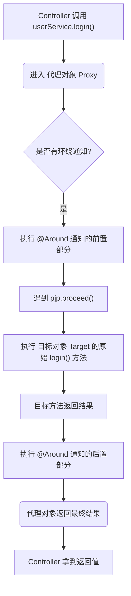
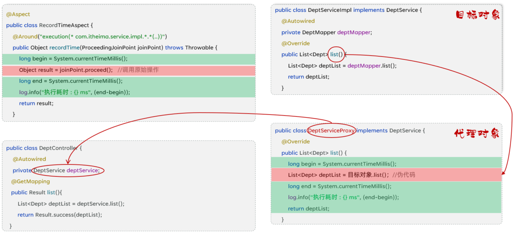
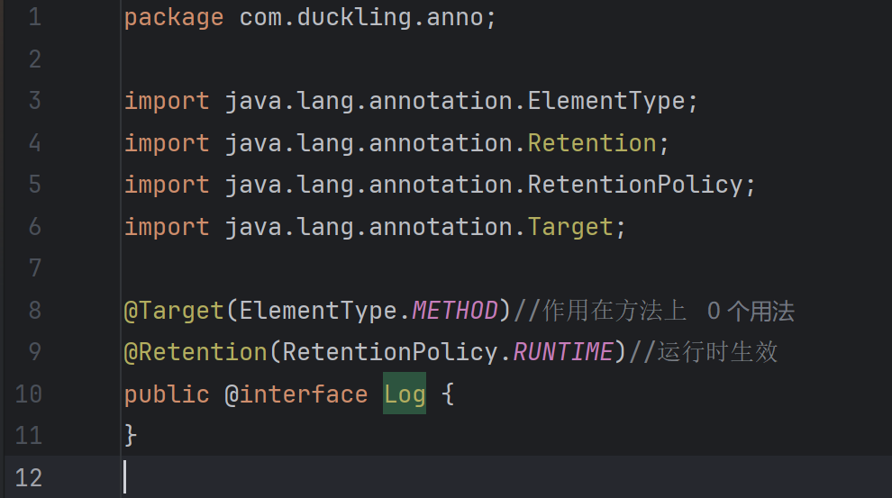
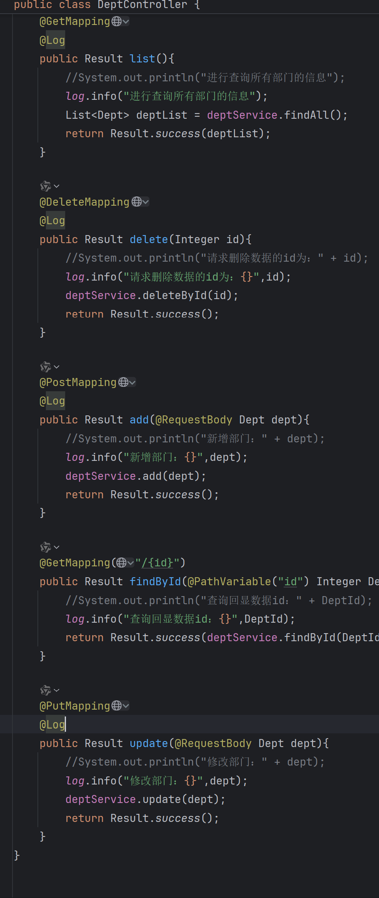
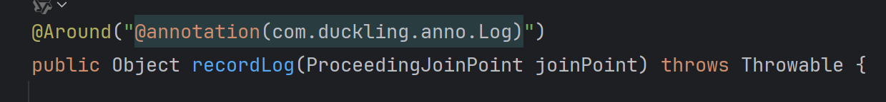

## 1. AOP 基础

### 1.1 连接点 (Join Point)

- **定义**：程序执行过程中的任意位置，在 Spring AOP 中，主要指**所有可以被增强的方法**。
- **通俗理解**：你的 Service 类里写了 10 个方法，这 10 个方法理论上**都有资格**被 AOP 拦截，它们都是连接点。

### 1.2 切入点 (Pointcut)

- **定义**：对连接点进行过滤的定义（通常使用表达式 `execution(...)` 或注解 `@annotation`）。
- **通俗理解**：虽然 Service 有 10 个方法（连接点），但我只想拦截其中的 `saveUser()` 方法。这个**“选中的规则”**就是切入点。
  - *关系：连接点是候选者，切入点是最终选中的集合。*

### 1.3 通知 (Advice)

- **定义**：指在切入点上要执行的**具体逻辑代码**。
- **类型**：包括前置通知 (`@Before`)、后置通知 (`@After`)、环绕通知 (`@Around`) 等。
- **通俗理解**：你拦截到方法后**想干什么**？比如“记录日志”、“开启事务”或者“权限校验”，这些具体的业务逻辑就是通知。

### 1.4 切面 (Aspect)

- **定义**：是切入点 (Pointcut) 和通知 (Advice) 的结合体。一个包含 `@Aspect` 注解的类。
- **通俗理解**：切面是一个“容器类”，它告诉 Spring：**在哪里（切入点）做什幺（通知）**。

### 1.5 目标对象 (Target Object)

- **定义**：被一个或多个切面所通知的对象。
- **通俗理解**：就是你原本写的那个 Service 类（比如 `UserServiceImpl`），也就是被“动了手脚”的那个原始对象。

------

## 2. AOP 底层实现原理 (Under the Hood)

这部分是你理解的核心，主要基于 **动态代理 (Dynamic Proxy)** 技术。

### 2.1 代理对象的生成

当 Spring 容器启动并初始化 Bean 时，它会检测某个 Bean（比如 `UserService`）是否被切面（Aspect）所覆盖（即是否匹配到了切入点）。

- **如果匹配到**：Spring 不会直接把原始的 `UserService` 对象放入容器，而是基于它生成一个 **代理对象 (Proxy Object)**。
- **如果没有匹配**：则直接创建原始对象。

> **注意**：Spring Boot 2.x 以后默认优先使用 **CGLIB** 代理（基于继承），如果类实现了接口也可能使用 **JDK 动态代理**（基于接口）。

### 2.2 依赖注入 (Dependency Injection) 的真相

在 Controller 层中，我们通常这样写：

```Java
@RestController
public class UserController {
    @Autowired
    private UserService userService; // 这里注入的到底是谁？

    public void login() {
        userService.login(); // 调用方法
    }
}
```

- **注入过程**：当 Controller 向 Spring 容器索要 `UserService` 时，因为 AOP 的存在，Spring 容器给它的**不是**原本定义的 `UserServiceImpl` 实例，而是**生成的那个代理对象**。
- **指向关系**：`userService` 变量 -> **指向** -> `代理对象 (Proxy)` -> **持有** -> `目标对象 (Target)`。

------

## 3. 运行时的执行流程 (Execution Flow)

当你调用 `userService.login()` 时，实际执行的是代理对象内部的逻辑。以下是基于**环绕通知 (`@Around`)** 的典型执行顺序：

### 流程图解




### 代码逻辑映射

假设你在切面中写了如下代码：

```Java
@Around("...") // 环绕通知
public Object recordLog(ProceedingJoinPoint pjp) throws Throwable {
    // 1. 代理对象先执行这里
    System.out.println(">>> 开启事务/记录日志...");

    // 2. 关键点：pjp.proceed()
    // 这行代码就像一个开关，它会去调用“目标对象”的原始方法
    Object result = pjp.proceed(); 

    // 3. 原始方法执行完，控制权回到代理对象
    System.out.println(">>> 提交事务/结束日志...");

    return result; // 4. 将结果返回给 Controller
}
```

### 

------

## 4. AOP 进阶

### 4.1 通知类型

Spring 提供了 5 种通知类型，通过不同的注解实现：

| **注解**          | **通知类型** | **执行时机**     | **备注**                                                     |
| ----------------- | ------------ | ---------------- | ------------------------------------------------------------ |
| **`@Around`**     | **环绕通知** | **方法执行前后** | **功能最强**。必须调用 `pjp.proceed()` 执行原始方法；必须返回 Object。 |
| `@Before`         | 前置通知     | 方法执行前       | 常用于参数校验。                                             |
| `@After`          | 后置通知     | 方法执行后       | 无论是否异常都会执行（类似 finally）。                       |
| `@AfterReturning` | 返回后通知   | 方法正常返回后   | 发生异常时不执行。                                           |
| `@AfterThrowing`  | 异常后通知   | 方法抛出异常后   | 仅在报错时执行。                                             |

### 4.2 通知顺序

当多个切面类（Aspect）同时切入同一个方法时，执行顺序如下：

- **默认规则**：按照切面类的**类名字母排序**。
- **自定义控制**：使用 **`@Order(数字)`** 注解。
  - **规则**：
    - **前置通知** (`Before`)：数字越**小**，越**先**执行。
    - **后置通知** (`After`)：数字越**小**，越**后**执行。
  - **模型**：类似于“洋葱圈”或“栈”结构（先进后出）。

### 4.3 切入点表达式

用于描述需要增强哪些方法，主要有两种写法：

#### 4.3.1 execution (根据方法签名匹配)

- **语法**：`execution(访问修饰符? 返回值 包名.类名.?方法名(方法参数) throws 异常?)`
- **通配符**：
  - `*` ：匹配单个任意符号（任意返回值、包名、类名、方法名、单个参数）。
  - `..` ：匹配多个连续任意符号（任意层级包、任意个数参数）。
- **常用示例**：
  - `execution(* com.itheima.service.*.*(..))`：匹配 service 包下所有类的所有方法。
  - `execution(* com.itheima.service.impl.DeptServiceImpl.delete(*))`：匹配特定类的 delete 方法。
- **建议**：基于接口描述，不基于实现类描述，增强扩展性。

#### 4.3.2 @annotation (根据注解匹配)

- **适用场景**：当需要匹配的方法**没有规律**（例如：既包含 `save` 又包含 `delete`，但不包含 `get`），使用 execution 很难描述时。

- **步骤**：

  自定义一个注解（如 `@Log`）。

  

  在需要增强的方法上加上该注解。

  

  表达式写法：`"@annotation(com.duckling.anno.Log)"`。

  

------

## 5. AOP 案例：操作日志记录

### 5.1 需求

记录系统中所有“增、删、改”功能接口的操作日志。

- **记录字段**：操作人 ID、操作时间、全类名、方法名、方法参数、返回值、执行耗时。

### 5.2 分析

- **技术选型**：使用 AOP 的 **`@Around` 环绕通知**（因为需要同时获取开始时间、结束时间和返回值）。
- **切入点**：由于增删改方法名可能不规则，采用 **`@annotation`** 方式。

### 5.3 步骤

1. 引入 AOP 依赖。
2. 准备数据库表 `operate_log` 和实体类。
3. 自定义注解 `@LogOperation`。
4. 编写切面类 `OperationLogAspect`，实现日志记录逻辑。

### 5.4 代码实现 (核心逻辑)

```Java
@Aspect
@Component
public class OperationLogAspect {
    @Autowired
    private OperateLogMapper operateLogMapper;

    @Around("@annotation(com.itheima.anno.LogOperation)")
    public Object recordLog(ProceedingJoinPoint joinPoint) throws Throwable {
        // 1. 记录开始时间
        long begin = System.currentTimeMillis();
        // 2. 执行原始方法
        Object result = joinPoint.proceed();
        // 3. 计算耗时
        long end = System.currentTimeMillis();
        
        // 4. 获取日志信息并保存 (异步或同步)
        OperateLog log = new OperateLog();
        log.setClassName(joinPoint.getTarget().getClass().getName()); // 类名
        log.setMethodName(joinPoint.getSignature().getName());       // 方法名
        log.setMethodParams(Arrays.toString(joinPoint.getArgs()));   // 参数
        log.setReturnValue(result.toString());                       // 返回值
        // ... 设置其他属性 ...
        operateLogMapper.insert(log);

        return result;
    }
}
```

### 5.5 连接点 (JoinPoint)

在通知方法中，通过参数获取目标方法的信息：

- **`ProceedingJoinPoint`**：**仅用于 `@Around`**。特有方法 `proceed()` 用于执行目标方法。
- **`JoinPoint`**：用于其他四种通知。
- **常用 API**：
  - `getArgs()`: 获取方法参数。
  - `getTarget()`: 获取目标对象。
  - `getSignature()`: 获取方法签名（方法名等）。

### 5.6 获取当前登录员工

AOP 切面本身无法直接从 Request 中解析 Token（虽然可以注入 Request，但解析逻辑重复）。最佳实践是结合 **Filter/Interceptor** 和 **ThreadLocal**。

#### 5.6.1 ThreadLocal

- **定义**：线程局部变量。
- **作用**：为每个线程提供独立的变量副本，实现**线程间的数据隔离**。Tomcat 中每个请求由一个独立线程处理，ThreadLocal 非常适合在同一个请求的调用链（Filter -> Controller -> Service -> AOP -> Mapper）中共享数据。
- **核心方法**：
  - `set(T value)`: 存入数据。
  - `get()`: 取出数据。
  - **`remove()`**: 清理数据（**至关重要**，防止内存泄漏）。

#### 5.6.2 记录当前登录员工 (完整流程)

1. **准备工具类**：创建一个 `BaseContext` 工具类，封装 ThreadLocal 的 set/get/remove 方法。
2. **Filter/Interceptor 层**：
   - 解析请求头中的 JWT 令牌。
   - 获取用户 ID。
   - 调用 `BaseContext.setCurrentId(id)` **存入** ThreadLocal。
   - **关键点**：在 `finally` 块或 `afterCompletion` 中调用 `BaseContext.remove()` **清理**数据。
3. **AOP 层**：
   - 直接调用 `BaseContext.getCurrentId()` 获取当前操作人的 ID，填入日志对象。
