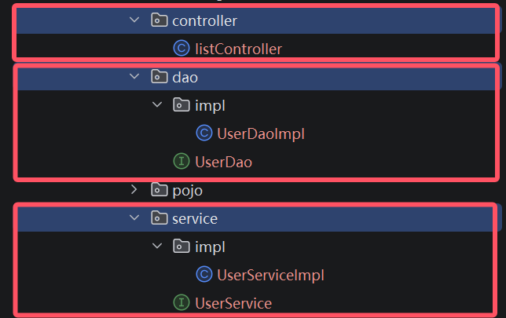

# 三层框架

## 介绍

在开发中，尽可能让每一个接口，方法，类的职责分工明确，提高可读性，扩展性；利于后期维护。

这种原则叫做**单一职责原则**：

> 一个类或一个方法，就只做一件事情，只管一块功能。

对于一个业务，可以拆分成三层：

1. Controller：控制层。接收前端发送的请求，对请求进行处理，并响应数据。
2. Service：业务逻辑层。处理具体的业务逻辑。
3. Dao：数据访问层(Data Access Object)，也称为持久层。负责数据访问操作，包括数据的增、删、改、查。

执行流程为：

- 前端发起请求
- Controller层接收请求
- Controller层调用Service进行逻辑处理
- Service去调用Dao获取所需数据
- Dao层从网路上或者数据库中拿到数据并返回Service
- Service对待处理数据进行逻辑处理并返回Controller
- Controller把最终结果响应给前端
- 前端收到响应

针对于这三层 一般会创建第三个包方便管理

- `controller`
- `service`
- `dao`

对于每个包内一般采用**面向接口**的方式进行代码书写:

在每一层的包下书写接口类，再定义一个`impl`包用于书写该接口的实现类

实现类的命名规则为`接口名Impl`；示例如下：



# 分层解耦

## 分析问题

对于当前业务逻辑：当前端请求地址`/list`时，后端需要从项目文件下的`src/main/resources/user.txt`文件进行读取数据

文件格式如下：

```
1,daqiao,1234567890,大乔,22,2024-07-15 15:05:45
2,xiaoqiao,1234567890,小乔,18,2024-07-15 15:12:09
3,diaochan,1234567890,貂蝉,21,2024-07-15 15:07:16
4,lvbu,1234567890,吕布,28,2024-07-16 10:05:15
5,zhaoyun,1234567890,赵云,27,2024-07-16 11:03:28
6,zhangfei,1234567890,张飞,31,2024-07-16 11:03:28
7,guanyu,1234567890,关羽,34,2024-07-16 12:05:12
8,liubei,1234567890,刘备,37,2024-07-16 15:03:28
```

读取到数据后进行拆分并封装成已经定义好的类`User`：

```java
package io.duckling.pojo;
import lombok.AllArgsConstructor;
import lombok.Data;
import lombok.NoArgsConstructor;

import java.time.LocalDateTime;

@Data //自动生成 get 和 set 方法
@NoArgsConstructor //无参构造
@AllArgsConstructor //有参构造
public class User {
    private Integer id;
    private String username;
    private String password;
    private String name;
    private Integer age;
    private LocalDateTime updateTime;
}
```

封装好后，合成一个List集合进行返回。

所以`Controller`层这么写：

```java
@RestController
public class UserController {
    
    private UserService userService = new UserServiceImpl();

    @RequestMapping("/list")
    public List<User> list(){
        //1.调用Service
        List<User> userList = userService.findAll();
        //2.响应数据
        return userList;
    }

}
```

`Service`层中的`UserSerivce`接口：

```java
public interface UserService {
    //返回将数据转换成 User 类的数组
    public List<User> findAll();
}
```

`Service`层中的`UserServiceImpl`实现类：

```java
public class UserServiceImpl implements UserService {

    private UserDao userDao = new UserDaoImpl();

    @Override
    public List<User> findAll() {
        List<String> lines = userDao.findAll();
        List<User> userList = lines.stream().map(line -> {
            String[] parts = line.split(",");
            Integer id = Integer.parseInt(parts[0]);
            String username = parts[1];
            String password = parts[2];
            String name = parts[3];
            Integer age = Integer.parseInt(parts[4]);
            LocalDateTime updateTime = LocalDateTime.parse(parts[5], DateTimeFormatter.ofPattern("yyyy-MM-dd HH:mm:ss"));
            return new User(id, username, password, name, age, updateTime);
        }).collect(Collectors.toList());
        return userList;
    }
}
```

`Dao`层中的`UserDao`接口：

```java
public interface UserDao {

    public List<String> findAll();

}
```

`Dao`层中的`UserDaoImpl`实现类：

```java
public class UserDaoImpl implements UserDao {
    @Override
    public List<String> findAll() {
        InputStream in = this.getClass().getClassLoader().getResourceAsStream("user.txt");
        ArrayList<String> lines = IoUtil.readLines(in, StandardCharsets.UTF_8, new ArrayList<>());
        return lines;
    }
}
```


我们发现 每一层调用其它层的实现类时需要去构建这个实现类对象，比如在`Controller`层中new了`UserServiceImpl()`

如果说我们需要更换实现类，比如由于业务的变更，UserServiceImpl 不能满足现有的业务需求，我们需要切换为 UserServiceImpl2 这套实现，就需要修改Contorller的代码，需要创建 UserServiceImpl2 的实现`new UserServiceImpl2()` 。

Service中调用Dao，也是类似的问题。

这种情况称之为层与层之间 **耦合** 了。

耦合和内聚的概念：

- **内聚：**软件中各个功能模块内部的功能联系。
- **耦合：**衡量软件中各个层/模块之间的依赖、关联的程度。

**软件设计原则：高内聚低耦合。**

> **高内聚**：指的是一个模块中各个元素之间的联系的紧密程度，如果各个元素(语句、程序段)之间的联系程度越高，则内聚性越高，即 "高内聚"。
>
> **低耦合：**指的是软件中各个层、模块之间的依赖关联程序越低越好。

## 优化

我们要对现在这种情况进行**解耦**。

我们不再new一个实现类对象，取而代之的是

- 提供一个容器，容器中存储一些对象(例：UserService对象)
- Controller程序从容器中获取UserService类型的对象

### 核心概念

需要用到**SpringBoot**中的两个**核心概念**：

- **控制反转**： Inversion Of Control，简称**IOC**。对象的创建控制权由程序自身转移到外部（容器），这种思想称为控制反转。
  - 对象的创建权由程序员主动创建转移到容器(由容器创建、管理对象)。这个容器称为：IOC容器或Spring容器。
- **依赖注入**：= Dependency Injection，简称**DI**。容器为应用程序提供运行时，所依赖的资源，称之为依赖注入。
  - 程序运行时需要某个资源，此时容器就为其提供这个资源。
  - 例：EmpController程序运行时需要EmpService对象，Spring容器就为其提供并注入EmpService对象。

- **bean对象：**IOC容器中创建、管理的对象，称之为：bean对象。

# IOC && DI

## 初步演示

**1). 将Service及Dao层的实现类，交给IOC容器管理**

在实现类加上 `@Component` 注解，就代表把当前类产生的对象交给IOC容器管理。

```Java
@Component
public class UserDaoImpl implements UserDao {
    @Override
    public List<String> findAll() {
        InputStream in = this.getClass().getClassLoader().getResourceAsStream("user.txt");
        ArrayList<String> lines = IoUtil.readLines(in, StandardCharsets.UTF_8, new ArrayList<>());
        return lines;
    }
}
```
<br>

```Java
@Component
public class UserServiceImpl implements UserService {

    private UserDao userDao;

    @Override
    public List<User> findAll() {
        List<String> lines = userDao.findAll();
        List<User> userList = lines.stream().map(line -> {
            String[] parts = line.split(",");
            Integer id = Integer.parseInt(parts[0]);
            String username = parts[1];
            String password = parts[2];
            String name = parts[3];
            Integer age = Integer.parseInt(parts[4]);
            LocalDateTime updateTime = LocalDateTime.parse(parts[5], DateTimeFormatter.ofPattern("yyyy-MM-dd HH:mm:ss"));
            return new User(id, username, password, name, age, updateTime);
        }).collect(Collectors.toList());
        return userList;
    }
}
```

**2). 为Controller 及 Service注入运行时所依赖的对象**

```Java
@Component
public class UserServiceImpl implements UserService {

    @Autowired
    private UserDao userDao;
    
    @Override
    public List<User> findAll() {
        List<String> lines = userDao.findAll();
        List<User> userList = lines.stream().map(line -> {
            String[] parts = line.split(",");
            Integer id = Integer.parseInt(parts[0]);
            String username = parts[1];
            String password = parts[2];
            String name = parts[3];
            Integer age = Integer.parseInt(parts[4]);
            LocalDateTime updateTime = LocalDateTime.parse(parts[5], DateTimeFormatter.ofPattern("yyyy-MM-dd HH:mm:ss"));
            return new User(id, username, password, name, age, updateTime);
        }).collect(Collectors.toList());
        return userList;
    }
}
```


```Java
@RestController
public class UserController {
    
    @Autowired
    private UserService userService;

    @RequestMapping("/list")
    public List<User> list(){
        //1.调用Service
        List<User> userList = userService.findAll();
        //2.响应数据
        return userList;
    }

}
```

这只是初步对IOC和DI进行了演示，下面进行详细介绍：

## IOC详解

前面我们提到IOC控制反转，就是将对象的控制权交给Spring的IOC容器，由IOC容器创建及管理对象。IOC容器创建的对象称为bean对象。

Spring框架提供了四种不同的@Component的衍生注解：

| 注解        | 说明                 | 位置                                              |
| ----------- | -------------------- | ------------------------------------------------- |
| @Component  | 声明bean的基础注解   | 不属于以下三类时，用此注解                        |
| @Controller | @Component的衍生注解 | 标注在控制层类上                                  |
| @Service    | @Component的衍生注解 | 标注在业务层类上                                  |
| @Repository | @Component的衍生注解 | 标注在数据访问层类上（由于与mybatis整合，用的少） |

那么此时，我们就可以使用 `@Service` 注解声明Service层的bean。 使用 `@Repository` 注解声明Dao层的bean。 代码实现如下：

Service层:

```Java
@Service
public class UserServiceImpl implements UserService {

    private UserDao userDao;

    @Override
    public List<User> findAll() {
        List<String> lines = userDao.findAll();
        List<User> userList = lines.stream().map(line -> {
            String[] parts = line.split(",");
            Integer id = Integer.parseInt(parts[0]);
            String username = parts[1];
            String password = parts[2];
            String name = parts[3];
            Integer age = Integer.parseInt(parts[4]);
            LocalDateTime updateTime = LocalDateTime.parse(parts[5], DateTimeFormatter.ofPattern("yyyy-MM-dd HH:mm:ss"));
            return new User(id, username, password, name, age, updateTime);
        }).collect(Collectors.toList());
        return userList;
    }
}
```

Dao层:

```Java
@Repository
public class UserDaoImpl implements UserDao {
    @Override
    public List<String> findAll() {
        InputStream in = this.getClass().getClassLoader().getResourceAsStream("user.txt");
        ArrayList<String> lines = IoUtil.readLines(in, StandardCharsets.UTF_8, new ArrayList<>());
        return lines;
    }
}
```

### 注意事项

**注意1**：声明bean的时候，可以通过注解的value属性指定bean的名字，如果没有指定，默认为类名首字母小写。

**注意2**：使用以上四个注解都可以声明bean，但是在springboot集成web开发中，声明控制器bean只能用@Controller。

### 组件扫描

- 前面声明bean的四大注解，要想生效，还需要被组件扫描注解 `@ComponentScan` 扫描。
- 该注解虽然没有显式配置，但是实际上已经包含在了启动类声明注解 `@SpringBootApplication` 中，默认扫描的范围是启动类所在包及其子包。

所以，我们在项目开发中，只需要按照如上项目结构，将项目中的所有的业务类，都放在启动类所在包的子包中，就无需考虑组件扫描问题。

## DI详解

依赖注入，是指IOC容器要为应用程序去提供运行时所依赖的资源，而资源指的就是对象。

在入门程序案例中，我们使用了@Autowired这个注解，完成了依赖注入的操作，而这个Autowired翻译过来叫：自动装配。

`@Autowired`注解，默认是按照**类型**进行自动装配的（去IOC容器中找某个类型的对象，然后完成注入操作）

### @Autowired三种用法

1). 属性注入

```Java
@RestController
public class UserController {

    //方式一: 属性注入
    @Autowired
    private UserService userService;
    
  }
```

- 优点：代码简洁、方便快速开发。
- 缺点：隐藏了类之间的依赖关系、可能会破坏类的封装性。

2). 构造函数注入

```Java
@RestController
public class UserController {

    //方式二: 构造器注入
    private final UserService userService;
    
    @Autowired //如果当前类中只存在一个构造函数, @Autowired可以省略
    public UserController(UserService userService) {
        this.userService = userService;
    }
    
 }   
```

- 优点：能清晰地看到类的依赖关系、提高了代码的安全性。
- 缺点：代码繁琐、如果构造参数过多，可能会导致构造函数臃肿。
- **注意：如果只有一个构造函数，@Autowired注解可以省略。（通常来说，也只有一个构造函数）**

3). setter注入

```Java
/**
 * 用户信息Controller
 */
@RestController
public class UserController {
    
    //方式三: setter注入
    private UserService userService;
    
    @Autowired
    public void setUserService(UserService userService) {
        this.userService = userService;
    }
    
}    
```

- 优点：保持了类的封装性，依赖关系更清晰。
- 缺点：需要额外编写setter方法，增加了代码量。

在项目开发中，基于@Autowired进行依赖注入时，基本都是第一种和第二种方式。（官方推荐第二种方式，因为会更加规范）但是在企业项目开发中，很多的项目中，也会选择第一种方式因为更加简洁、高效（在规范性方面进行了妥协）。

## IOC容器中存在多个同类型bean对象的情况

那如果在IOC容器中，存在多个相同类型的bean对象，会出现什么情况呢？

比如对于Service层中的UserService有两个实现类UserServiceImpl和UserServiceImpl2

那就会报错，因为在Spring的容器中，UserService这个类型的bean存在两个，框架不知道具体要注入哪个bean使用，所以就报错了。

Spring提供了以下几种解决方案：

- @Primary
- @Qualifier
- @Resource

**方案一：使用@Primary注解**

当存在多个相同类型的Bean注入时，加上@Primary注解，来确定默认的实现。

```Java
@Primary
@Service
public class UserServiceImpl implements UserService {
}
```

**方案二：使用@Qualifier注解**

指定当前要注入的bean对象。 在@Qualifier的value属性中，指定注入的bean的名称。 @Qualifier注解不能单独使用，必须配合@Autowired使用。

```Java
@RestController
public class UserController {

    @Qualifier("userServiceImpl")
    @Autowired
    private UserService userService;
```

**方案三：使用@Resource注解**

是按照bean的名称进行注入。通过name属性指定要注入的bean的名称。

```Java
@RestController
public class UserController {
        
    @Resource(name = "userServiceImpl")
    private UserService userService;
```

面试题：@Autowird 与 @Resource的区别

- @Autowired 是spring框架提供的注解，而@Resource是JDK提供的注解
- @Autowired 默认是按照类型注入，而@Resource是按照名称注入

*注：@Qualifier和@Resource中填写的名称是bean的名称 当在创建bean对象的时候若没有指定名字，则默认名为该bean的类名，类名首字母小写*

*如：UserServiceImpl的bean名称为userServiceImpl*

*关于bean名称相关请看[注1](#注意事项)