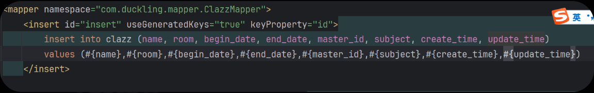

在 XML 文件中，**`<`** （小于号）和 **`>`** （大于号）是**保留字符**，用于定义标签（比如 `<select>`、`<if>`）。

当 XML 解析器读到 `WHEN CURDATE() < begin_date` 中的 `<` 时，它以为你要开始写一个新的标签，结果后面跟的是空格和 `begin_date`，它就懵了，所以报语法错误。

------

### 解决方案

你有两种修改方式，**推荐使用第一种**。

#### 方法一：使用转义字符（推荐）

把 SQL 中的特殊符号替换成 XML 能识别的转义符。

| **原符号** | **含义** | **XML 转义写法** | **记忆口诀**         |
| ---------- | -------- | ---------------- | -------------------- |
| **`<`**    | 小于     | **`<`**          | **l**ess **t**han    |
| **`>`**    | 大于     | **>**            | **g**reater **t**han |
| `&`        | 和       | `&`              | ampersand            |

为什么这个时候识别不出来实体类的名字？开着驼峰命名呢

这是一个非常经典的误解。

**核心结论：** **“驼峰命名映射”（`map-underscore-to-camel-case`）只对“查询（Select）”的结果封装生效，对“插入/更新（Insert/Update）”的参数传递完全无效！**

你之所以报错或者识别不出来，是因为你在 SQL 的 `#{}` 占位符里写了**数据库的列名**（下划线），而 MyBatis 在这里要的是**Java 类的属性名**（驼峰）。

MyBatis 解析到 `#{master_id}` 时，它会去你的 `Clazz` 实体类里找 `getMaster_id()` 方法。

但是你的实体类遵循驼峰命名，只有 `getMasterId()` 方法。

**结果：** 找不到 Getter 方法，报错 `ReflectionException: There is no getter for property named 'master_id'...`。

### 3. 深度原理解析

为了让你彻底记住，请看这个对比：

#### A. 查数据 (`SELECT`) -> 驼峰配置生效

- **方向：** 数据库 $\to$ Java
- **配置作用：** 当数据库返回列 `master_id` 时，MyBatis 看到配置文件开启了驼峰，会自动把它转换成 `masterId` 去匹配你的 Java 类。

#### B. 存数据 (`INSERT`) -> 驼峰配置**不**生效

- **方向：** Java $\to$ 数据库
- **原理：** `#{xxx}` 的本质是调用 Java 对象的 `getXxx()` 方法拿到值，然后填入 SQL。
- MyBatis 不会自动把你写的 `#{master_id}` 翻译成 `getMasterId()`。它只会傻傻地去调 `getMaster_id()`，调不到就报错。

**一句话总结：SQL 语句中，括号左边的字段名写“数据库列名”（下划线），VALUES 括号里的 `#{...}` 写“Java 属性名”（驼峰）。**

### 一张表总结区别

| **URL 样式**   | **注解**            | **对应的 GetMapping**  | **场景**         |
| -------------- | ------------------- | ---------------------- | ---------------- |
| `/clazzs/5`    | **`@PathVariable`** | `@GetMapping("/{id}")` | 获取单条资源详情 |
| `/clazzs?id=5` | **`@RequestParam`** | `@GetMapping`          | 搜索、筛选、分页 |

**结论：** 你的代码里写了 `/{id}`，所以请直接把 `@RequestParam` 改成 **`@PathVariable`** 即可！