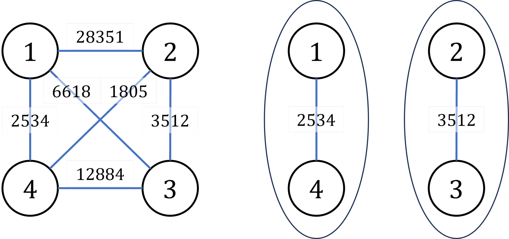

# 【每日算法】P1525关押罪犯

## 题目背景

NOIP2010 提高组 T3

## 题目描述

S 城现有两座监狱，一共关押着 $N$ 名罪犯，编号分别为 $1\sim N$。他们之间的关系自然也极不和谐。很多罪犯之间甚至积怨已久，如果客观条件具备则随时可能爆发冲突。我们用“怨气值”（一个正整数值）来表示某两名罪犯之间的仇恨程度，怨气值越大，则这两名罪犯之间的积怨越多。如果两名怨气值为 $c$ 的罪犯被关押在同一监狱，他们俩之间会发生摩擦，并造成影响力为 $c$ 的冲突事件。

每年年末，警察局会将本年内监狱中的所有冲突事件按影响力从大到小排成一个列表，然后上报到 S 城 Z 市长那里。公务繁忙的 Z 市长只会去看列表中的第一个事件的影响力，如果影响很坏，他就会考虑撤换警察局长。

在详细考察了 $N$ 名罪犯间的矛盾关系后，警察局长觉得压力巨大。他准备将罪犯们在两座监狱内重新分配，以求产生的冲突事件影响力都较小，从而保住自己的乌纱帽。假设只要处于同一监狱内的某两个罪犯间有仇恨，那么他们一定会在每年的某个时候发生摩擦。

那么，应如何分配罪犯，才能使 Z 市长看到的那个冲突事件的影响力最小？这个最小值是多少？

## 输入格式

每行中两个数之间用一个空格隔开。第一行为两个正整数 $N,M$，分别表示罪犯的数目以及存在仇恨的罪犯对数。接下来的 $M$ 行每行为三个正整数 $a_j,b_j,c_j$，表示 $a_j$ 号和 $b_j$ 号罪犯之间存在仇恨，其怨气值为 $c_j$。数据保证 $1\le a_j< b_j\leq N, 0 < c_j\leq 10^9$，且每对罪犯组合只出现一次。

## 输出格式

共一行，为 Z 市长看到的那个冲突事件的影响力。如果本年内监狱中未发生任何冲突事件，请输出 `0`。

## 输入输出样例 #1

### 输入 #1

```
4 6
1 4 2534
2 3 3512
1 2 28351
1 3 6618
2 4 1805
3 4 12884
```

### 输出 #1

```
3512
```

## 说明/提示

**输入输出样例说明**

罪犯之间的怨气值如下面左图所示，右图所示为罪犯的分配方法，市长看到的冲突事件影响力是 $3512$（由 $2$ 号和 $3$ 号罪犯引发）。其他任何分法都不会比这个分法更优。



**数据范围**  

对于 $30\%$ 的数据有 $N\leq 15$。

对于 $70\%$ 的数据有 $N\leq 2000,M\leq 50000$。  

对于 $100\%$ 的数据有 $N\leq 20000,M\leq 100000$。

---

## 题解：

```c++
#include<bits/stdc++.h>
using namespace std;
const int N = 20005;
struct node{
	int a,b,c;
}no[100000];
int f[N];
int em[N];
int n, m;
int find(int x){return x == f[x] ? x : f[x] = find(f[x]);} 
void me(int x, int y){
	int a = find(x);
	int b = find(y);
	if(a != b){
		f[a] = b;
	}
}
bool cmp(node a, node b){return a.c > b.c;}
int main(){
	cin >> n >> m;
	for(int i = 1; i <= n; i++) f[i] = i;
	for(int i = 1; i <= m; i++){
		cin >> no[i].a >> no[i].b >> no[i].c;
	}
	sort(no+1,no+1+m,cmp);
	bool fl = 0;
	for(int i = 1; i <= m; i++){
		int a = no[i].a, b = no[i].b;
		int fa = find(a), fb = find(b);
		if(fa == fb){
			fl = 1;
			cout << no[i].c;
			break;
		}
		if(!em[a]) em[a] = b;
		else me(b, em[a]);
		
		if(!em[b]) em[b] = a;
		else me(a, em[b]);
	}
	if(!fl) cout << 0;
	return 0;
}
```

